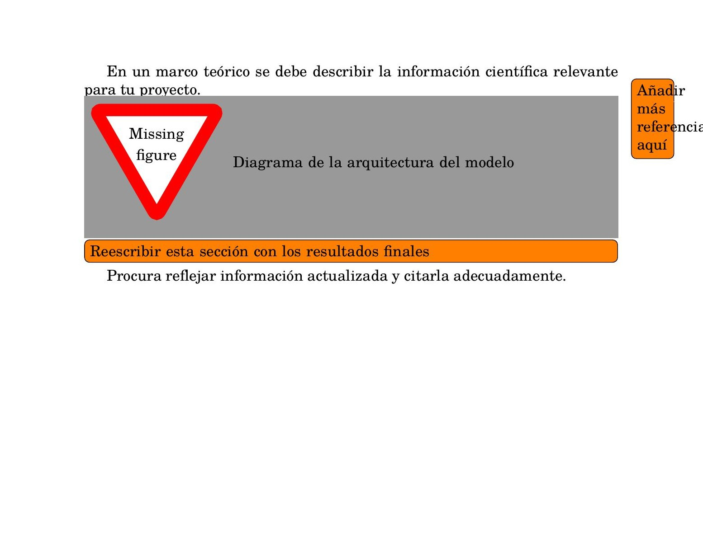

# UAX TFM LaTeX Template

**Autor:** Kenny Berrones

[](https://github.com/kberrones/) [](https://www.linkedin.com/in/k-berrones/)

---

Plantilla LaTeX para el **Trabajo de Fin de Master (TFM)** del Master Universitario en Inteligencia Artificial de la Universidad Alfonso X el Sabio (UAX), con bibliografia en formato APA mediante `biblatex` + `biber`.

Replica fiel de la plantilla DOCX oficial, con medidas extraidas directamente del documento original.

## Uso rapido

1. Rellena tus datos en `config/metadata.tex`.
2. Escribe tu contenido en los capitulos dentro de `chapters/`.
3. Anade tus fuentes en `bibliography.bib`.
4. Cita en el texto con `\parencite{}` o `\textcite{}`.
5. Compila con la secuencia completa (ver [Compilacion](#compilar)).

## Requisitos

- **XeLaTeX** (incluido en MiKTeX o TeX Live)
- **Biber** (incluido en MiKTeX o TeX Live)
- Paquetes: `fontspec`, `fancyhdr`, `titlesec`, `tocloft`, `enumitem`, `tikz`, `eso-pic`, `hyperref`, `graphicx`, `xcolor`, `array`, `biblatex`, `biblatex-apa` (se instalan automaticamente con MiKTeX)

### Instalacion

#### Windows

1. Descarga e instala [MiKTeX](https://miktex.org/download) (recomendado) o [TeX Live](https://tug.org/texlive/).
2. Durante la instalacion de MiKTeX, marca la opcion **"Install missing packages on the fly: Yes"** para que los paquetes se descarguen automaticamente al compilar.
3. Biber se incluye con MiKTeX. Si no lo tienes, abre MiKTeX Console > Packages > busca `biber` e instala.
4. Verifica la instalacion abriendo una terminal (cmd o PowerShell):

```bash
xelatex --version
biber --version
```

#### macOS

Instala [MacTeX](https://tug.org/mactex/) (incluye TeX Live completo con XeLaTeX y Biber):

```bash
# Con Homebrew
brew install --cask mactex

# Verifica
xelatex --version
biber --version
```

Tras la instalacion puede ser necesario reiniciar la terminal o anadir `/Library/TeX/texbin` al PATH.

#### Linux (Ubuntu/Debian)

```bash
sudo apt update
sudo apt install texlive-xetex texlive-bibtex-extra biber texlive-fonts-extra texlive-lang-spanish

# Verifica
xelatex --version
biber --version
```

Para otras distribuciones, instala los paquetes equivalentes de `texlive-xetex`, `texlive-bibtex-extra` y `biber`.

### Fuentes

La plantilla usa las siguientes fuentes con fallbacks libres:

| Fuente real | Fallback libre | Uso |
|---|---|---|
| Century Schoolbook | TeX Gyre Schola | Cuerpo del documento |
| Times New Roman | TeX Gyre Termes | Portada -- columna izquierda |
| Arial | Liberation Sans | Portada -- bloque superior derecho |
| Century Gothic | TeX Gyre Heros | Portada -- bloque inferior derecho |

Para usar las fuentes reales (si las tienes instaladas), descomenta las lineas correspondientes en `config/packages.tex` y `chapters/cover.tex`.

> **Nota:** La fuente "Century" de Windows no soporta acentos. Usa **Century Schoolbook** en su lugar (`\setmainfont{Century Schoolbook}` en `config/packages.tex`).

## Estructura del proyecto

```
uax_tfm_project/
|-- main.tex                  # Punto de entrada -- compilar este fichero
|-- bibliography.bib          # Base de datos bibliografica
|-- config/
|   |-- metadata.tex          # Datos personales (titulo, autor, director, fecha)
|   |-- packages.tex          # Paquetes, fuentes, colores UAX
|   |-- styles.tex            # Estilos de headings, listas, bibliografia, comandos
|   +-- layout.tex            # Headers, footers, formato del indice (TOC)
|-- chapters/
|   |-- cover.tex             # Portada
|   |-- abstract.tex          # Resumen / Abstract / Palabras clave
|   |-- chapter1.tex          # Capitulo 1: Introduccion al TFM
|   |-- chapter2.tex          # Capitulo 2: Objetivos del TFM
|   |-- chapter3.tex          # Capitulo 3: Marco Teorico / Estado del Arte
|   |-- chapter4.tex          # Capitulo 4: Marco Metodologico
|   |-- chapter5.tex          # Capitulo 5: Resultados y discusion
|   |-- chapter6.tex          # Capitulo 6: Conclusiones
|   |-- bibliography.tex      # Bibliografia (generada automaticamente desde .bib)
|   +-- appendix.tex          # Anexos (con marca de agua del sello UAX)
|-- images/
|   |-- transparent_logo.png  # Logo UAX horizontal (portada + header)
|   |-- uax_seal.png          # Sello circular UAX
|   +-- uax_watermark.png     # Sello UAX para marca de agua en Anexos
|-- build/                    # Salida de compilacion (generado automaticamente)
|-- .gitignore
+-- README.md
```

## Compilar

Con `biblatex` + `biber`, la compilacion va por fases. No es un error que `xelatex` aparezca varias veces:

1. `xelatex main.tex` -- genera auxiliares y `main.bcf`.
2. `biber main` -- procesa `bibliography.bib` y genera `main.bbl`.
3. `xelatex main.tex` -- inserta citas y bibliografia en el PDF.
4. `xelatex main.tex` -- estabiliza indice y referencias cruzadas.

### Compilacion completa (primera vez o cuando cambias citas/bibliografia)

```bash
mkdir -p build
xelatex -output-directory=build main.tex
biber --output-directory=build main
xelatex -output-directory=build main.tex
xelatex -output-directory=build main.tex
```

### Compilacion rapida (si solo cambias texto, sin tocar citas ni indice)

```bash
xelatex -output-directory=build main.tex
```

El PDF se genera en `build/main.pdf`.

### Desde VS Code

1. **Instala la extension [LaTeX Workshop](https://marketplace.visualstudio.com/items?itemName=James-Yu.latex-workshop)** (de James Yu).

2. **Anade esta configuracion** a tu `settings.json` (Ctrl+Shift+P > "Preferences: Open User Settings (JSON)"):

```json
{
    "latex-workshop.latex.tools": [
        {
            "name": "xelatex",
            "command": "xelatex",
            "args": [
                "-synctex=1",
                "-interaction=nonstopmode",
                "-output-directory=build",
                "%DOC%"
            ]
        },
        {
            "name": "biber",
            "command": "biber",
            "args": [
                "--output-directory=build",
                "%DOCFILE%"
            ]
        }
    ],
    "latex-workshop.latex.recipes": [
        {
            "name": "xelatex + biber",
            "tools": ["xelatex", "biber", "xelatex", "xelatex"]
        }
    ],
    "latex-workshop.latex.outDir": "build",
    "latex-workshop.view.pdf.viewer": "tab"
}
```

3. **Crea la carpeta `build/`** en la raiz del proyecto.

4. **Atajos utiles:**

| Atajo | Accion |
|---|---|
| `Ctrl+Alt+B` | Compilar |
| `Ctrl+Alt+V` | Ver PDF en pestana lateral |
| `Ctrl+Click` PDF | Salta a la linea correspondiente en el `.tex` |
| `Ctrl+Click` TeX | Salta al punto correspondiente en el PDF |

### Desde Overleaf

1. Sube el proyecto como zip: New Project > Upload Project.
2. Compila. Overleaf ejecuta biber automaticamente.

> **Nota:** Se puede dar el caso de que se supere el timeout del plan gratuito de Overleaf. Si fuese el caso entonces sería mejor tener un repositorio en local y compilar con las herramientas mencionadas.

## Como usar la plantilla

### Datos personales

Edita **un solo fichero** -- `config/metadata.tex`:

```latex
\newcommand{\autorTFM}{Tu Nombre, Apellido1 Apellido2}
\newcommand{\directorTFM}{Nombre del Director/a}
\newcommand{\tituloTFM}{Tu titulo aqui}
\newcommand{\fechaTFM}{Junio 2026}
\newcommand{\logoTFM}{transparent_logo.png}
```

Estos datos se usan automaticamente en la portada, headers y footers. No hace falta tocar ningun otro fichero.

### Escribir contenido

Cada capitulo es un fichero independiente en `chapters/`. Escribe directamente el texto del capitulo reemplazando las instrucciones entre corchetes `[...]`.

Estilos disponibles:

```latex
% Titulo de capitulo
\chapterUnnumbered{Capitulo 1: Tu Titulo}

% Secciones (apartados) -- numeracion automatica
\setcounter{section}{0}   % resetear al inicio de cada capitulo
\section{Tu apartado}

% Subsecciones (subapartados)
\subsection{Tu subapartado}

% Vinetas
\begin{itemize}
  \item Elemento con vineta
\end{itemize}

% Lista numerada
\begin{enumerate}
  \item Primer elemento
  \item Segundo elemento
\end{enumerate}

% Cita literal APA (mas de 40 palabras)
\begin{citaLiteralAPA}
Texto de la cita textual aqui...
\end{citaLiteralAPA}
```

> **Nota:** Si un `\item` va seguido de un corchete `[`, usa `\item{} [texto]` para evitar que LaTeX lo interprete como argumento opcional.

### Citas APA en el texto

Anade tus referencias en `bibliography.bib` y citalas asi:

```latex
% Cita narrativa: Sanchez-Cabrero et al. (2018) demuestran que...
Segun \textcite{sanchez2018demographic}, la evidencia muestra una relacion significativa.

% Cita entre parentesis: (Sanchez-Cabrero et al., 2018)
La evidencia muestra una relacion significativa \parencite{sanchez2018demographic}.

% Cita con pagina: (Sanchez-Cabrero et al., 2018, p. 67)
\parencite[p.~67]{sanchez2018demographic}
```

La bibliografia se genera automaticamente en formato APA 7 con sangria francesa. `\nocite{*}` en `bibliography.tex` incluye todas las entradas del `.bib` -- quitalo cuando solo quieras mostrar las que cites.

### Anadir imagenes

Coloca las imagenes en la carpeta `images/` y referencialas asi:

```latex
\begin{figure}[htbp]
  \centering
  \includegraphics[width=0.8\textwidth]{mi_imagen.png}
  \caption{Descripcion de la imagen.}
  \label{fig:mi-imagen}
\end{figure}
```

### Anadir tablas

```latex
\begin{table}[htbp]
  \centering
  \caption{Descripcion de la tabla.}
  \label{tab:mi-tabla}
  \begin{tabular}{lcc}
    \toprule
    Columna 1 & Columna 2 & Columna 3 \\
    \midrule
    Dato 1    & Dato 2    & Dato 3    \\
    Dato 4    & Dato 5    & Dato 6    \\
    \bottomrule
  \end{tabular}
\end{table}
```

## Consejos para el TFM

### Placeholders con todonotes

Mientras escribes, es util marcar figuras pendientes, secciones por revisar o notas para ti mismo. Anade `\usepackage{todonotes}` en `config/packages.tex` y usa:

```latex
\missingfigure{Aqui va el diagrama de la arquitectura}
\todo{Anadir mas referencias aqui}
\todo[inline]{Reescribir esta seccion con los resultados finales}
```

Asi se ve en el PDF:



Para ocultar todos los `\todo` y `\missingfigure` al entregar, cambia a:

```latex
\usepackage[disable]{todonotes}
```

### Redaccion impersonal

La UAX recomienda redactar en estilo impersonal:

| Evitar | Usar |
|---|---|
| Realice / realizamos | Se ha realizado |
| Partimos de | Se parte de |
| Pretendi / pretendimos | Se pretende |
| Elegimos este proyecto | Se ha elegido este proyecto |

### Estructura de los capitulos

Antes de cada capitulo con apartados, incluye un parrafo introductorio que explique brevemente lo que contiene. Evita poner dos titulos seguidos sin texto entre ellos.

### Referencias y citas

Usa normas APA 7a edicion. Fuentes habituales:

- [Google Scholar](https://scholar.google.es/) -- buscador principal
- [Scopus](https://www.scopus.com/) -- base de datos cientifica
- [IEEE Xplore](https://ieeexplore.ieee.org/) -- ingenieria y computacion
- [arXiv](https://arxiv.org/) -- preprints de IA/ML
- [Semantic Scholar](https://www.semanticscholar.org/) -- busqueda con IA

### Tamanos recomendados por capitulo

| Capitulo | Paginas recomendadas |
|---|---|
| 1. Introduccion | 5-10 |
| 2. Objetivos | 1-3 |
| 3. Marco Teorico | 10-20 |
| 4. Marco Metodologico | 5-15 |
| 5. Resultados y discusion | 5-15 |
| 6. Conclusiones | 5-10 |

El TFM debe tener entre 50.000 y 60.000 palabras.

## Colores UAX

| Color | Hex | Uso |
|---|---|---|
| Endeavour | `#0060AB` | Titulos, bordes, enlaces, listas |
| Regal Blue | `#003F70` | Texto de header/footer |
| White | `#FFFFFF` | Fondo |

## Medidas del original

Todas las medidas de la plantilla fueron extraidas del PDF generado a partir del DOCX oficial usando `pymupdf`. Las posiciones exactas estan documentadas como comentarios en cada fichero `.tex`.

| Elemento | Medida |
|---|---|
| Pagina | A4 (21.00 x 29.70 cm) |
| Margen izquierdo | 3.00 cm |
| Margen derecho | 2.86 cm |
| Margen superior | 3.50 cm |
| Margen inferior | 3.50 cm |
| Ancho util de texto | 15.14 cm |
| Header logo (imagen) | 4.26 x 0.93 cm |
| Footer separador | Triple barra 0.4pt |
| Titulo capitulo | 20pt |
| Titulo apartado | 16pt |
| Texto cuerpo | 12pt |
| Entradas TOC | 11pt |
| "Anexos" (pagina titulo) | 72pt |
| Watermark sello | 18.44 x 18.44 cm |

## Detalles tecnicos

### Footer

El footer replica el formato del DOCX original: una tabla de 1 fila con 2 columnas. La primera columna contiene el titulo del TFM en italica alineado a la derecha, y la segunda el numero de pagina centrado verticalmente. El separador es una triple barra vertical azul. El footer soporta titulos largos que ocupen varias lineas.

### Portada

La portada usa 3 familias tipograficas distintas y esta construida enteramente con TikZ sobre coordenadas absolutas extraidas del DOCX original. Los datos editables (titulo, autor, director, fecha) se leen de `config/metadata.tex`.

### Indice (TOC)

Los enlaces del indice aparecen en negro (no en azul) gracias a `\hypersetup{hidelinks}` aplicado solo dentro del bloque del TOC. El titulo "INDICE" se muestra en azul a 20pt.

### Bibliografia

Gestionada con `biblatex` (estilo APA 7) y `biber` como backend. Las referencias se definen en `bibliography.bib` y se generan automaticamente con `\printbibliography`. El mapeo `spanish-apa` asegura que las fechas y conectores se muestren en espanol.
